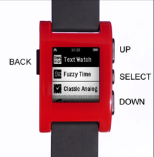
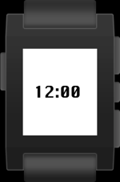
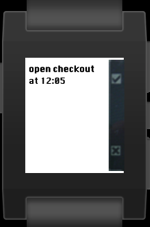
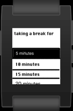

build application using Pebble sdk.
```
pebble build
```
To install an application
```
pebble install --serial /dev/tty.Pebble623D-SerialPortSe
```


|        |            |   
| ------------- |:-------------:|
| Buttons    | 
 | 
| Application    |
     |  
| Boolean menu |      |  
| List menu|    |  
